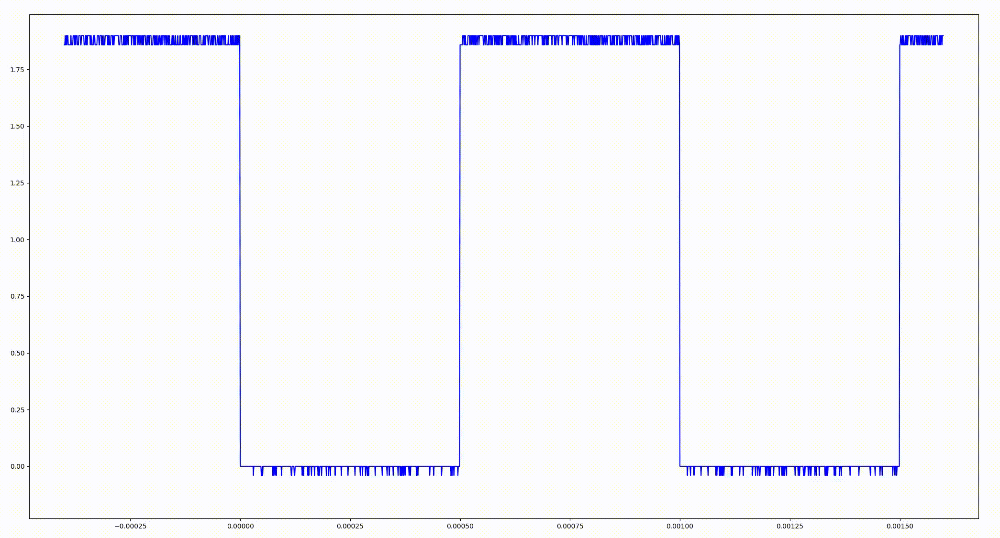

# hantekosc

Hantekosc provides a Python interface to control the mobile USB-oscilloscopes made by Hantek.
It is based on library "Hantek6022API" (https://github.com/Ho-Ro/Hantek6022API).

This is primarily extended by a **software trigger**.

Furthermore, settings like **recording length**, **sample rate**, **presample ratio** or **trigger mode** 
can now be set in a simple way

Example for initializing an oscilloscope device:

```python

from hantekosc import oscilloscope

osc = oscilloscope.Oscilloscope()
osc.channels[0].voltage_range = 5
osc.channels[1].voltage_range = 5
osc.trigger_mode = 'REPEAT'
osc.sample_rate = 1 * 1e6
osc.record_length = 2000
osc.pre_sample_ratio = 0.2
osc.selected_channel = 0
osc.channels[0].trigger_kind = 'FALLING'
osc.channels[0].trigger_level = 0.5

osc.start()
```

Example of retrieving data from the oscilloscope's channel 1 after initialization:
```python
timing_data = osc.channels[0].measured_data[0]
voltage_data = osc.channels[0].measured_data[1]
```

## Installation requirements
Just copy the 60-hantek6022api rules to the system's folder:

```
curl -fsSL https://raw.githubusercontent.com/BMecke/hantekosc/main/PyHT6022/udev/60-hantek6022api.rules | sudo tee /etc/udev/rules.d/60-hantek6022api.rules
```

Restart “udev” management tool:Restart “udev” management tool:
```
sudo service udev restart
```

Install hantekosc (The use of virtual environments is recommended):
```
pip install hantekosc
```

## Output of example.py

